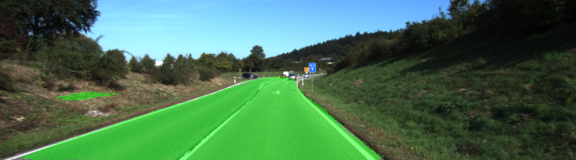
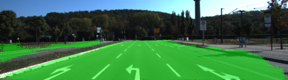
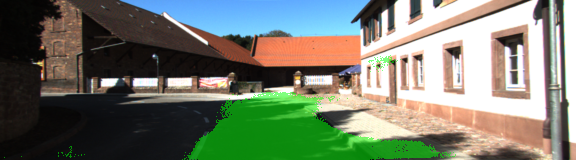

# Semantic Segmentation using Fully Convolutional Networks (FCN)
### Introduction

The goal of this project is to label areas of an image that contain roads.
Segmentation of the image into 'road' and 'non-road' areas are achieved with the help of an FCN.

### Architecture
The FCN is on top of a trained VGG-16 network by appending the upscaling layers as described in this paper: [Fully Convolutional Networks for Semantic Segmentation](https://people.eecs.berkeley.edu/~jonlong/long_shelhamer_fcn.pdf)

#### Transpose convolutions
Upsampling with a factor f is achived by using a backwards convolution with a stride of [f,f].

[Tensor flow](https://www.tensorflow.org/) provides a transponse convolution operation ([tf.layers.conv2d_transpose](https://www.tensorflow.org/api_docs/python/tf/nn/conv2d_transpose)) that is used to upsample layers till the final ouput's dimensions matches the input image dimension.

For example, if the input image dimensions are 160x576 (rows x cols):

|Name | Type | Size|
|-----|------|-----|
|Input| Image| [160 576 3] |
|Layer 1| Convolutions| |
|Layer 2 | Convolutions | 
|Layer 3 | Convolutions |[1 20 72 256]|
|Layer 4| Convolutions | [1 10 36 512] |
|Layer 5| Convolutions | 
|Layer 6| Convolutions | 
|Layer 7| Convolutions | [1 5 18 4096] |
|Layer 8| 1x1 Convolution|
|Layer 9| Tranpose Conv. 4x4 kernel, 2x2 stride | [1 10 36 512] |
|Layer 10|Tranpose Conv. 4x4 kernel, 2x2 stride |[1 20 72 256]|
|Layer 11|Tranpose Conv. 8x8 kernel and stride |[1 160 576 2]|

Layers 1 to 7 are part of the pre-trained VGG network that was loaded from a saved model.

Layer 8 is the 1x1 convolution that lies between the encode and decoder part of the FCN.

Layers 9 to 11 are the upsampling layers that end in producing a 160x576 matrix for each class - in this case, two.

#### Skip connections
Skip connections are used to preserve higher level information from earlier layers and propogate them to layers in the decoder part of the FCN.
The outputs of layer 4 is added to layer 9 and layer 3 to layer 10.

Fusing information from earlier layers allows the model to make local predictions while taking golbal context information into account. This results in finer details in segmentation.


### Augmentation
The training data set obtained from the [Kitti Road dataset](http://www.cvlibs.net/download.php?file=data_road.zip) was augmented to make the network become more tolerent to shadows on the road cast by trees and adjacent buildings.

Four images were added for each one in the data set with the following modifications:
1. Arbitrary shadow added to image
2. Brightness of entire image reduced to 0.5 (moderately dark)
3. Brightness of entire image reduced to 0.75 (slightly darker)
3. Brightness of entire image reduced to 0.25 (very dark)

Copies have an "aug" inserted in the file name, ex: um_aug00124.png.
The label files were appropriately copied with matching filenames.


### Output Image Samples

The model did well on most images like these:




But it did not cover all of the road on shaded, curved streets like this:


### Video
I used a video provided by Udacity in term 1 for advanced lane finding project.
The frames from this video were individually sent through the FCN for segmentation and the segmented image was saved with road areas highlighted in pink.

<a href="http://www.youtube.com/watch?feature=player_embedded&v=1IAcDALwW9s" target="_blank"></a>


### Setup
##### Frameworks and Packages
Make sure you have the following is installed:
 - [Python 3](https://www.python.org/)
 - [TensorFlow](https://www.tensorflow.org/)
 - [NumPy](http://www.numpy.org/)
 - [SciPy](https://www.scipy.org/)
##### Dataset
Download the [Kitti Road dataset](http://www.cvlibs.net/datasets/kitti/eval_road.php) from [here](http://www.cvlibs.net/download.php?file=data_road.zip).  Extract the dataset in the `data` folder.  This will create the folder `data_road` with all the training a test images.

### Start

##### Run
Run the following command to run the project:
```
python main.py
```

